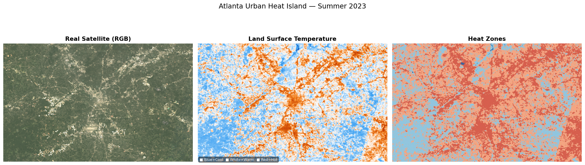
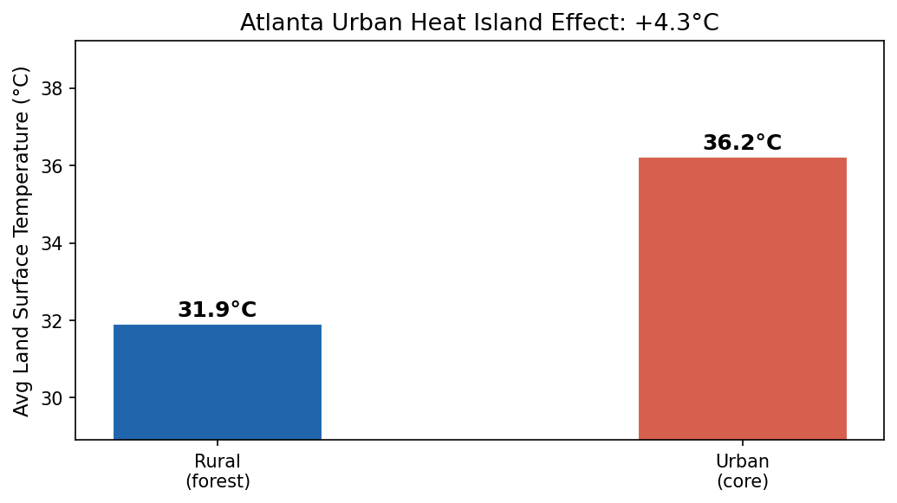
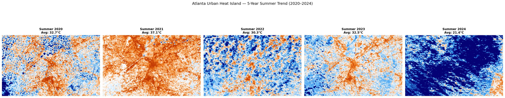
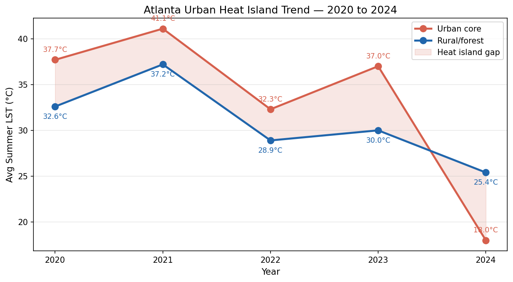
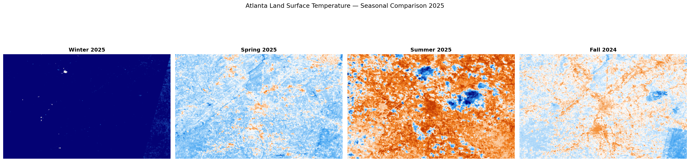

# NDVI land cover classification using Sentinel-2 + GEE

# 🌡️ Urban Heat Island Mapping — Atlanta, GA



## Overview
This project maps **Land Surface Temperature (LST)** across Atlanta 
using **Landsat 8 thermal imagery**, quantifying the Urban Heat Island 
effect and tracking temperature trends across 5 summers (2020–2024).

## Outputs

### Urban vs Rural Temperature Comparison


### 5-Year Summer Trend


### Temperature Trend Line


### Seasonal Comparison 2025


## Methodology
| Parameter | Value |
|---|---|
| Satellite | Landsat 8 Collection 2 (Band B10) |
| Date Range | June – August (2020–2024) |
| Cloud Filter | < 20% cloud cover |
| Resolution | 30m |
| LST Formula | ST_B10 × 0.00341802 + 149.0 − 273.15 |

## Heat Zone Classification
| Zone | Temperature | Color |
|---|---|---|
| Cool (vegetation) | < 25°C | 🔵 Blue |
| Moderate | 25 – 30°C | 🔵 Light blue |
| Warm (suburban) | 30 – 35°C | 🟠 Orange |
| Hot (urban core) | > 35°C | 🔴 Red |

## Key Findings
- Atlanta's urban core averages **36.2°C** vs **31.9°C** in rural forest areas
- **Heat island intensity: +4.3°C** during summer peak
- Urban road network (I-75, I-85, I-20) visible as persistent 
  heat corridors across all years
- Seasonal variation spans ~30°C between winter and summer
- UHI gap remains consistent across 2020–2024

## Tools & Libraries


- **Google Earth Engine** — Landsat 8 thermal data processing
- **matplotlib** — visualization and chart generation
- **numpy** — numerical analysis
- **earthengine-api** — GEE Python client

## Repository Structure
urban-heat-island-atlanta/
├── Urban_Heat_Island_Mapping_Atlanta.ipynb  ← main notebook
├── outputs/
│   ├── urban_heat_island.png
│   ├── uhi_comparison.png
│   ├── multiyear_comparison.png
│   ├── uhi_trend.png
│   └── seasonal_comparison_2025.png
├── requirements.txt
└── .gitignore

## How to Run
```bash
pip install earthengine-api geemap matplotlib numpy Pillow requests
jupyter notebook Urban_Heat_Island_Mapping_Atlanta.ipynb
```

## Data Sources
- [Landsat 8 Collection 2](https://developers.google.com/earth-engine/datasets/catalog/LANDSAT_LC08_C02_T1_L2) — USGS
